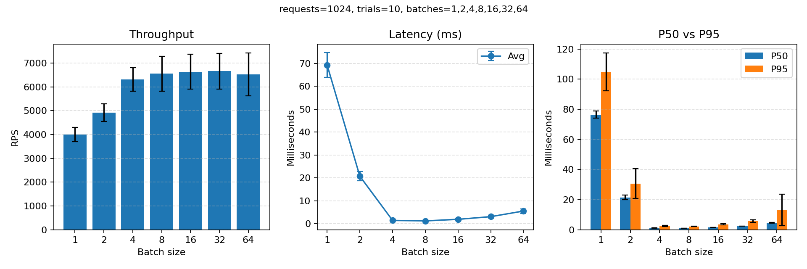

# minimal-inference-engine
This project is a minimal inference engine built from scratch with a systems-first mindset.<br>

It focuses exclusively on inference — not training — and is designed to
explore real-world performance tradeoffs such as latency vs throughput,
CPU vs GPU execution, and dynamic batching behavior.

The engine supports multiple backends including PyTorch, ONNX Runtime,
and TensorRT, and includes profiling tools and benchmarks to measure
end-to-end inference performance.

*No training code is included by design.*

## Batch size benchmark
We run a controlled benchmark that sends many single-sample requests and varies only the batch size. For each batch size, we measure:
- Throughput (requests/sec)
- Average latency
- P50 and P95 latency (median vs slow tail)

### How to run
```
python3 01_minimal-inference-engine/benchmarks/batch_size_bench.py \
  --requests 1024 --batch-sizes 1,2,4,8,16 --trials 10
```

This writes a plot to `result/batch_size_bench.png` showing:
- Throughput changes by batch size
- Average latency changes by batch size
- P50/P95 latency changes by batch size



The takeaway is that batching has a “sweet spot.” Too small means poor throughput; too large increases waiting time. In our runs, mid-sized batches (like 4–8) typically balance throughput and latency best.

### Why the graph look this way
These results illustrate the classic batching tradeoff in inference systems. Small batch sizes are dominated by per-request overhead, leading to low throughput and high latency. As batch size increases, overhead is amortized and hardware utilization improves, reducing average latency and increasing throughput. However, beyond an optimal batching regime, throughput saturates and tail latency grows due to batching-induced queueing delay, increased execution variance, and memory bandwidth limitations.
